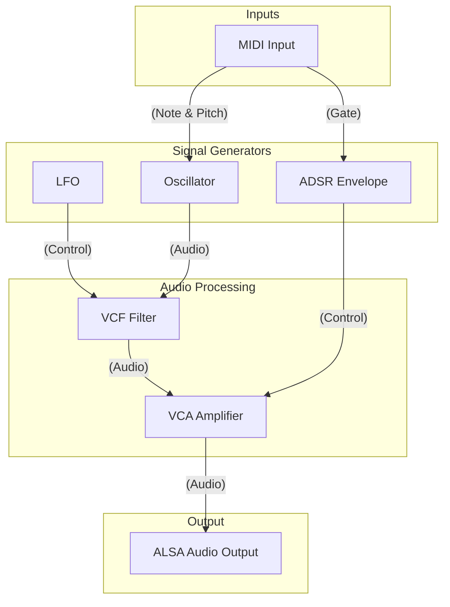

# TinySynth

[](https://opensource.org/licenses/MIT)
[](https://isocpp.org/)
[](https://github.com/YOUR_USERNAME/TinySynth/actions) <!-- Placeholder -->

A lightweight, modular, monophonic synthesizer engine written in C++ for Linux.

TinySynth is built around a flexible graph-based architecture where audio and control modules can be dynamically connected. It is designed for real-time performance with low latency, using ALSA for both MIDI input and audio output.

## Features

*   **Modular Architecture**: Connect modules like Oscillators, Filters, VCAs, and LFOs to create your own sound patches.
*   **Real-time Audio**: Optimized for low-latency audio processing.
*   **ALSA Native**: Uses the ALSA framework for MIDI and Audio, making it ideal for Linux-based audio workstations.
*   **Preset System**: A simple preset system allows you to get started quickly with predefined sounds like `bass` and `pianoSynth`.
*   **MIDI Control**: Control the synthesizer with any standard MIDI keyboard or sequencer.
*   **Extensible**: The C++ codebase is designed to be easy to extend with new modules.

## Architecture Overview

The synth operates as a directed graph of processing nodes. A `GraphManager` is responsible for processing the signal flow from generators to the final audio output.

Here is a simple example of a signal flow:



For a more detailed explanation, please see the [doc/ARCHITECTURE.md](doc/ARCHITECTURE.md) file.

## Installation

TinySynth uses CMake for building. Ensure you have `cmake`, `g++` (or `clang++`), and the ALSA development libraries (`libasound2-dev` on Debian/Ubuntu) installed.

```bash
# Clone the repository
git clone https://github.com/YOUR_USERNAME/TinySynth.git
cd TinySynth

# Create a build directory
mkdir build
cd build

# Configure and build the project
cmake ..
make
```

## Quick Start

1.  **Run the synthesizer**:
    ```bash
    ./build/tinysynth
    ```
2.  **List available MIDI ports**:
    Open another terminal and run:
    ```bash
    aconnect -l
    ```
    You should see `TinySynth` listed as a MIDI client.

3.  **Connect your MIDI keyboard**:
    Use `aconnect` to route your MIDI device's output to TinySynth's input. For example:
    ```bash
    # Example: aconnect <your_keyboard_client>:<port> <tinysynth_client>:<port>
    aconnect "My Keyboard:0" "TinySynth:0"
    ```
Now, playing notes on your MIDI keyboard should produce sound.

## Roadmap

This project is under active development. The current focus is on stabilizing the core engine and expanding the module library. Key future steps include:

*   **Phase 1: Core Engine (Complete)** - Basic sound generation with a static graph.
*   **Phase 2: MIDI & Envelopes (Complete)** - MIDI control and ADSR envelopes.
*   **Phase 3: Sound Shaping (In Progress)** - Implementation of VCF, VCA, and Mixers.
*   **Phase 4: Advanced Modulation** - LFOs, multi-oscillator detuning, and advanced MIDI control (Pitch Bend, CC mapping).
*   **Phase 5: Optimization & Presets** - Performance tuning and a robust preset system.

For more details, see the [ROADMAP.md](doc/ROADMAP.md) file.

## Contributing

Contributions are welcome! Please read the `CONTRIBUTING.md` file for guidelines on how to report bugs, request features, and submit pull requests.

## License

This project is licensed under the MIT License - see the [LICENSE](LICENSE) file for details.