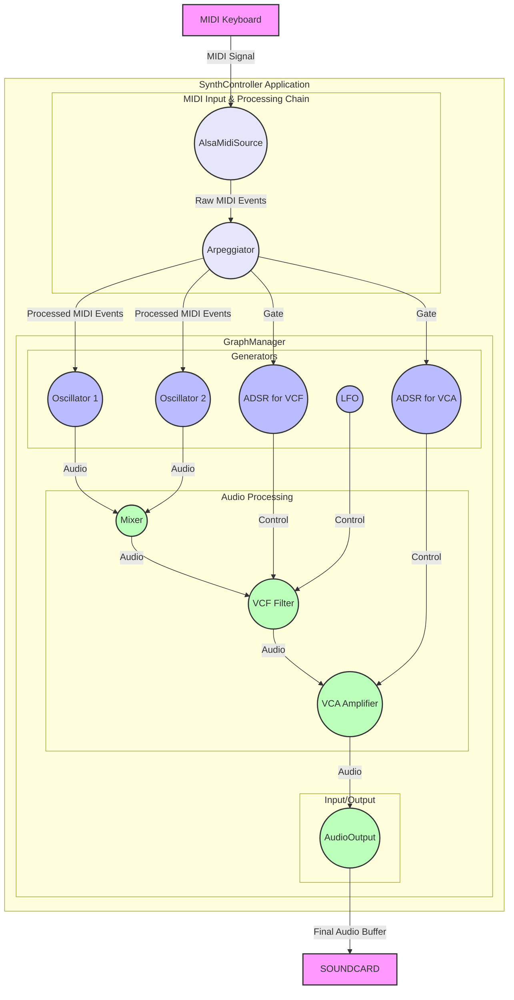

# TinySynth Software Architecture

This document provides a high-level overview of the TinySynth software architecture, from external hardware input to final audio output.

## Legend

*   `[Component]` : An external element or a high-level software component.
*   `((Module))` : A specific, pluggable module within the synthesis graph.
*   `-- (Data Type) -->` : Represents the flow of information, specifying the type of data.

## Architecture Diagram

This diagram shows how MIDI events are processed before they even reach the synthesis modules, and how the `GraphManager` orchestrates the audio signal path.

### Explanation of the Flow

1.  **External MIDI Input**: A user plays notes on a `MIDI Keyboard`.

2.  **MIDI Processing Chain**: 
    *   The `AlsaMidiSource` module captures the raw hardware MIDI events (note on/off, velocity, etc.) and converts them into a stream of `MidiEvent` objects.
    *   This stream is fed into one or more MIDI processors. In this example, it goes to the `Arpeggiator`, which transforms the incoming notes into a new sequence of `MidiEvent` objects (the arpeggio).

3.  **GraphManager - The Synthesis Core**: This component contains the actual synthesis patch.
    *   **Event Distribution**: The processed MIDI events from the `Arpeggiator` are now used to control the synth modules. The `Note` and `Pitch` information drives the `Oscillators`, while the `Gate` signal triggers the `ADSR` envelopes.
    *   **Sound Generation**: Two `Oscillators` generate raw audio waveforms. Using two allows for detuning to create a thicker, richer sound.
    *   **Mixing**: The signals from both oscillators are combined into a single stream by the `Mixer`.
    *   **Filtering (Timbre)**: The mixed signal is passed through a `VCF (Filter)`. The filter's cutoff frequency is modulated by both a dedicated `ADSR (ADSR_VCF)` for a dynamic filter sweep on each note, and an `LFO` for a constant wobble effect.
    *   **Amplification (Volume)**: The filtered signal goes to a `VCA (Amplifier)`. Its volume is controlled by another `ADSR (ADSR_VCA)`, which shapes the overall volume of the note (attack, decay, etc.).
    *   **Final Output Module**: The `AudioOutput` module collects the final processed audio signal.

4.  **External Audio Output**: The buffer from the `AudioOutput` module is sent to the `Audio Hardware` via ALSA, producing the sound you hear.

This architecture clearly separates the MIDI data handling from the audio graph, allowing for flexible MIDI processing (like adding/removing the arpeggiator) without changing the audio patch itself.
