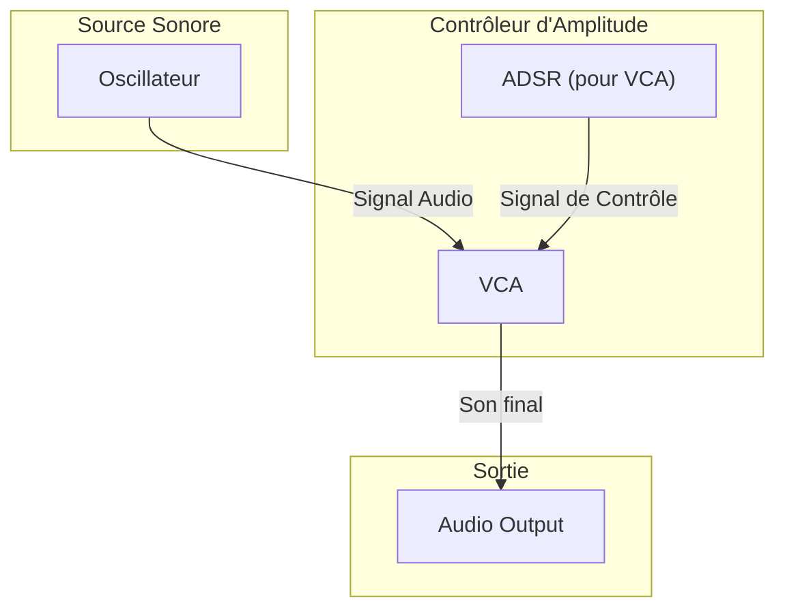
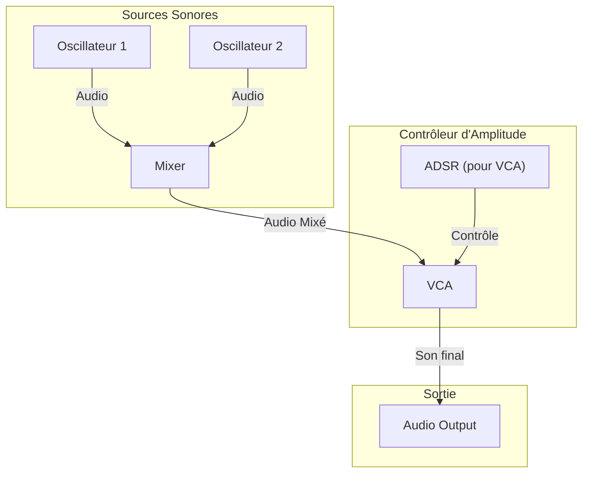
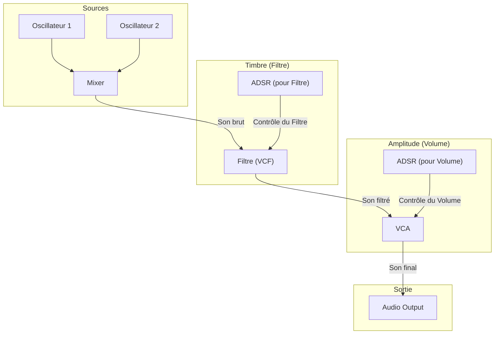

# Exemples de Flux de Signal (Signal Flow)

Ce document décrit différentes architectures de synthétiseurs, du plus simple au plus complet, pour illustrer comment les modules peuvent être connectés.

## 1. Synthétiseur Monophonique de Base

C'est l'architecture que nous avons mise en place. Un oscillateur génère le son, et un VCA contrôle son volume en fonction d'une enveloppe ADSR.

- **OSC (VCO)** : Génère l'onde brute (la hauteur de la note).
- **ADSR** : Génère une enveloppe (Attack, Decay, Sustain, Release) quand une note est jouée.
- **VCA** : Agit comme un portail. Il laisse passer le son de l'oscillateur en suivant la forme de l'enveloppe ADSR.

---

## 2. Synthétiseur à Plusieurs Oscillateurs

Pour créer des sons plus riches, on utilise plusieurs oscillateurs. Un module **Mixer** est nécessaire pour les additionner avant de traiter le volume.

- **Mixer** : Prend plusieurs signaux audio et les additionne pour n'en former qu'un seul.

---

## 3. Chemin de Synthèse Soustractive Complet

Un synthétiseur soustractif classique ajoute un **filtre (VCF)** pour sculpter le timbre du son. Le filtre lui-même est souvent contrôlé par sa propre enveloppe ADSR.

- **VCF (Voltage-Controlled Filter)** : Agit comme un égaliseur dynamique. Il retire des fréquences (par exemple, rend le son plus sourd ou plus brillant) pour changer le caractère du son.
- **ADSR pour le Filtre** : Permet de créer des effets de balayage, où le timbre du son évolue dans le temps (par exemple, un son qui devient plus brillant à l'attaque).