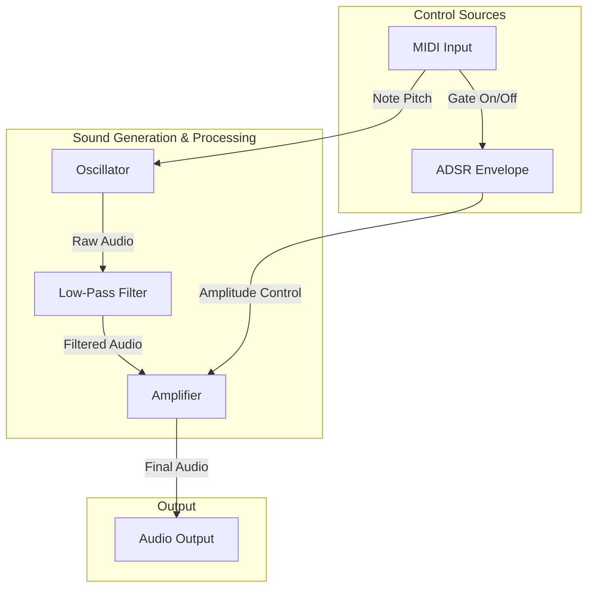

# TinySynth Tutorials

This file provides step-by-step guides for creating sounds with TinySynth.

---

## Tutorial 1: Creating a Simple Bass Patch

This tutorial explains how to set up a classic subtractive bass sound. This is one of the most common patches in synthesis and demonstrates the core principles of filtering a harmonically rich waveform.

### Goal

To create a punchy bass sound that responds to MIDI input.

### Required Modules

*   MIDI Input
*   Oscillator (VCO)
*   ADSR Envelope
*   Voltage-Controlled Filter (VCF)
*   Voltage-Controlled Amplifier (VCA)
*   Audio Output

### Conceptual Signal Flow

We will configure the modules to follow this path:



### Step-by-Step Configuration

This describes how the `GraphManager` should be configured in the C++ code to build the patch.

#### 1. The Sound Source: Oscillator

*   **Module**: `Oscillator`
*   **Waveform**: Select a harmonically rich waveform. A **Sawtooth** wave is a great starting point for a bass sound.
*   **Connection**: The `Frequency` input of the oscillator should be connected to the `Pitch` output of the MIDI handler.

#### 2. The Timbre Shaper: Filter (VCF)

*   **Module**: `VCF`
*   **Filter Type**: Set to **Low-Pass**. This will cut out the higher frequencies and let the low frequencies pass through, which is characteristic of a bass sound.
*   **Parameters**:
    *   `Cutoff Frequency`: Set this to a low value (e.g., 200-500 Hz) to make the sound deep and round.
    *   `Resonance`: Add a small amount of resonance to give the sound a bit of a liquid, squelchy character right at the cutoff frequency.
*   **Connection**: The `Audio Out` of the `Oscillator` is connected to the `Audio In` of the `VCF`.

#### 3. The Volume Shaper: Amplifier (VCA) & ADSR

*   **Modules**: `VCA` and `ADSR`
*   **ADSR Configuration**: For a punchy bass, use these settings:
    *   **Attack**: Very short (e.g., 0-5 ms). The sound should start instantly.
    *   **Decay**: Short to medium (e.g., 200-400 ms). This creates the percussive feel.
    *   **Sustain**: Low or zero (e.g., 0.0). For a plucked or percussive bass, the note fades out rather than being held.
    *   **Release**: Short (e.g., 50-100 ms). The sound should stop quickly after the key is released.
*   **Connections**:
    1.  The `Gate` signal from the MIDI handler is connected to the `Gate` input of the `ADSR` module.
    2.  The `Control Out` of the `ADSR` module is connected to the `Amplitude Modulation` input of the `VCA`.
    3.  The `Audio Out` of the `VCF` is connected to the `Audio In` of the `VCA`.

#### 4. The Final Output

*   **Module**: `AudioOutput`
*   **Connection**: The `Audio Out` of the `VCA` is connected to the `Audio In` of the `AudioOutput` module.

### Summary

By following these steps, you create a signal chain where a raw, bright oscillator sound is first darkened by a low-pass filter, and then its volume is shaped into a short, punchy note by an ADSR-controlled amplifier. This forms the foundation of a huge variety of synthesized sounds.

### Code Implementation Example

Here is a hypothetical C++ code snippet demonstrating how you might use the `GraphManager` to construct the bass patch. This code would typically reside in a preset loader or in the main application logic.

*Note: The exact method names and class structures might vary slightly.*

```cpp
#include "core/GraphManager.hpp"
#include "module/generator/Oscillator.hpp"
#include "module/processing/VCF.hpp"
#include "module/processing/VCA.hpp"
#include "module/utility/ADSRModule.hpp"
#include "module/IO/AudioOutput.hpp"
// A module to handle MIDI input is also assumed to exist.

void setupBassPatch(GraphManager& graph) {
    float sampleRate = 44100.0f; // default sample rate

    // Create modules
    auto osc1 = std::make_shared<Oscillator>(sampleRate);
    osc1->setWaveform(Waveform::Sawtooth); // set to Sawtooth wave

    auto osc2 = std::make_shared<Oscillator>(sampleRate);
    osc2->setWaveform(Waveform::Square);
    osc2->setDethune(0.5f); // slight detune for richness

    auto lfo = std::make_shared<LFO>(sampleRate);
    lfo->setWaveform(Waveform::Sine);
    lfo->setFrequency(5.0f); // 5 Hz

    auto adsr = std::make_shared<ADSRModule>(sampleRate);
    adsr->setAttack(0.01f);
    adsr->setDecay(0.1f);
    adsr->setSustain(0.8f);
    adsr->setRelease(0.2f);

    auto vcf = std::make_shared<VCF>(sampleRate);
    vcf->setCutoff(200.0f);
    vcf->setResonance(0.7f);

    auto vca = std::make_shared<VCA>();
    
    auto mixer = std::make_shared<Mixer>();
    
    auto probe = std::make_shared<Probe>("bass_output", "bass_output.bin"); // for debugging it will save the output to a file read with the debug tool

    auto audioOutput = std::shared_ptr<AudioOutput>(&AudioOutput::getInstance(), [](AudioOutput*){});

    // Connections
    // we add modules to the graph, its used to manage processing order and priority via topological sorting
    graph.addModule(osc1);
    graph.addModule(osc2);
    graph.addModule(lfo);
    graph.addModule(adsr);
    graph.addModule(vcf);
    graph.addModule(vca);
    graph.addModule(mixer);
    graph.addModule(probe);
    graph.addModule(audioOutput);

    graph.connect(mixer, osc1, 0); // Connect osc1 to mixer input 0 (serve for priority 0 is higher)
    graph.connect(mixer, osc2, 1);

    graph.connect(vcf, mixer, VCF::AUDIO_IN); // connect mixer output to VCF input defined as AUDIO_IN because only one input is allowed
    graph.connect(vcf, lfo, VCF::MOD_IN);

    graph.connect(vca, vcf, VCA::AUDIO_IN);
    graph.connect(vca, adsr, VCA::MOD_IN);

    graph.connect(audioOutput, vca, 0); // connect VCA output to audio output
}
```
